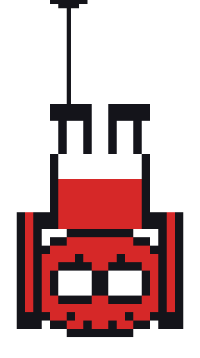

  

<h1 align="center">
  🕷️ Hey, I'm Cyndrick Abejo!
</h1>

  

  
  
  
  
  
  

  
  
  
  
  

> **"There's always room for improvements."** 

Welcome to my corner of the web!

I'm a Computer Engineering student who enjoys building things with code,
breaking things, fixing them, and learning something new along the way.

---

## 🕷️ About Me

- Computer Engineering Student
- Full-Stack Developer
- Interested in Web Development & DevOps
- Always learning something new
- Building projects one commit at a time
- Trying to become the developer my future self would be proud of

---

## 🕸️ Contribution Web

  

  <i>Every commit leaves a mark on the web. 🕷️</i>

---

## 🕷️ Featured Projects

###  GARBO
A waste management system designed to help improve garbage collection
and communication within communities.

###  U-ConvertIT
A student-focused web application featuring productivity and
AI-powered academic tools.

###  QuestGo
A web-based platform built with Next.js that connects users through
a quest-based system.

---
