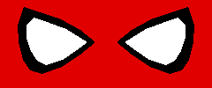

<!-- ============ ANIMATED HEADER ============ -->

  

  

<h1 align="center">
   Hey, I'm Cyndrick Abejo BSCPE!
</h1>

<!-- Typing animation: edit the lines= part to change the rotating text -->

  

  

  
  

---

## 👋 About Me

Welcome to my corner of the web!

I'm a Computer Engineering student at CIT-U who enjoys building things with code,
breaking things, fixing them, and learning something new along the way.

- 🎓 BS Computer Engineering @ **CIT-U**
- 🔭 Building full-stack web apps and AI-powered tools
- 🌱 Always learning: currently leveling up my Next.js and backend skills
- 📫 **Open to internships and entry-level opportunities**, so feel free to reach out!

---

## 🛠️ Tech Stack

| | |
|:--|:--|
| **Frontend** |  |
| **Backend & Database** |  |
| **Languages** |  |
| **Tools** |  |

---

## 🚀 Featured Projects

<!--
  These cards pull the description and main language straight from each repo.
  TODO: make sure the repo names below match your actual GitHub repos exactly.
  TODO: add live demo links next to each project if you have them.
-->

<table>
  <tr>
    <td width="50%" valign="top">
      <h3>🗑️ GARBO</h3>
      
A waste management system designed to help improve garbage collection and communication within communities.

      
    </td>
    <td width="50%" valign="top">
      <h3>🔄 U-ConvertIT</h3>
      
A student-focused web application featuring productivity and AI-powered academic tools.

      
    </td>
  </tr>
  <tr>
    <td width="50%" valign="top">
      <h3>🧭 QuestGo</h3>
      
A web-based platform built with Next.js that connects users through a quest-based system.

      
    </td>
    <td width="50%" valign="middle" align="center">
      <h3>✨ Want to see more?</h3>
      
Case studies, screenshots, and live demos are on my portfolio.

      
    </td>
  </tr>
</table>

---

<h1 align="center">
  Contributions
</h1>

  

  

  
  

<!-- Snake animation: needs the snake.yml workflow (see setup notes) -->

  <picture>
    <source media="(prefers-color-scheme: dark)" srcset="https://raw.githubusercontent.com/Cyn-sharp/Cyn-sharp/output/github-snake-dark.svg" />
    <source media="(prefers-color-scheme: light)" srcset="https://raw.githubusercontent.com/Cyn-sharp/Cyn-sharp/output/github-snake.svg" />
    
  </picture>

  
<b>📈 Click to expand: contribution activity graph</b>

   
  

    
  

  <i>Every commit leaves a mark on the web. 🕷️</i>

---

## 📬 Let's Connect

<!-- TODO: replace the LinkedIn and email placeholders with your real ones -->

  
  
  

